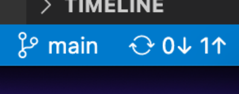
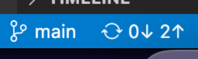

# Brolly Weather Repo

Because it looks like it is going to rain today.

The first thing I did after making this repo was to clone it to my local machine. I did this via:

```bash
git clone git@github.com:helendduncan/brolly_weather.git
```

You may notice that the repo also has a license, I just picked a default one from the options on initialisation.

Most repos have a `README.md` file which is where I put the most important or headline information.

I am typing this on my local machine, and I will push it to remote via the following commands...

```bash
git status
>>> On branch main
>>> Your branch is up to date with 'origin/main'.

>>> Changes not staged for commit:
>>>   (use "git add <file>..." to update what will be committed)
>>>   (use "git restore <file>..." to discard changes in working directory)
>>>         modified:   README.md

>>> no changes added to commit (use "git add" and/or "git commit -a")

git add README.md

git status
>>> On branch main
>>> Your branch is up to date with 'origin/main'.

>>> Changes to be committed:
>>>   (use "git restore --staged <file>..." to unstage)
>>>         modified:   README.md

git commit -m "updated README with git instruction"
>>> [main 6d1a99a] updated README with git instruction
>>>  1 file changed, 11 insertions(+), 2 deletions(-)
>>>  rewrite README.md (100%)

git push
>>>  Enumerating objects: 5, done.
>>>  Counting objects: 100% (5/5), done.
>>>  Delta compression using up to 8 threads
>>>  Compressing objects: 100% (3/3), done.
>>>  Writing objects: 100% (3/3), 588 bytes | 588.00 KiB/s, done.
>>>  Total 3 (delta 0), reused 0 (delta 0), pack-reused 0
>>>  To github.com:helendduncan/brolly_weather.git
   5985612..6d1a99a  main -> main

```

fork and public keys

#### First session:

In this session we ran through the process of adding, staging, and committing files to a github repo via the terminal and via VSCode. We also briefly discussed the possibility of editing files directly in the repo, although we didn't do that.

<p align="center">

</p>
In this example there is one commit ready to be pushed to the remote repo.

<p align="center">

</p>
In this example there are two commits ready to be pushed to the remote repo.


We took turns adding and changing files, looking to see how we can tell if we are behind or ahead of the main repo (note in starling, dev = main)

TLDR:
```
git add <filename.extension>
git commit -m "useful commit message"
git push
```

Potentially useful resources:
[The Turing Way](https://the-turing-way.netlify.app/collaboration/github-novice/github-novice-firststeps.html) guide to starting using Github.


## Branches and merges
I've added a couple of images. They are from the free image site unspash.com. I searched for the keyword hairspray.
The photographers are Gavin Allanwood, and Tuva Mathilde Loland.
<p align="center">

</p>

<p align="center">

</p>

Create a branch called images or something similar and add some images to this README on your own branch. Compare the READMEs on the main branch and your own branch.